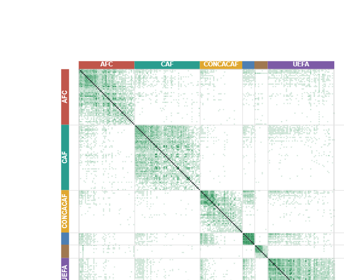

# National Team Matchup Grid

A Scorigami-inspired heatmap of international football. Every current FIFA member nation is a
row **and** a column of one massive grid; each cell is coloured by how many times those two
national teams have ever played each other. The point of the picture is the **negative space** —
the matchups that have *never* happened.

**▶ Live demo: https://dgoodenough.github.io/national-team-grid/**



Only **29% of all possible men's matchups** have ever been played — and only **13% of the women's**.
The rest of the grid is empty: pairs of countries that, in 150+ years of international football,
have simply never met.

## How to read it

- **Rows and columns** are national teams, **grouped by confederation** (AFC, CAF, CONCACAF,
  CONMEBOL, OFC, UEFA) and then ordered by FIFA ranking within each confederation. Teams in the
  same confederation play each other far more often, so the grid lights up in dense blocks down
  the diagonal, with sparse cross-confederation regions between them.
- **Cell colour** = number of times the pair has met (log-scaled, cool → hot). The most-played
  men's fixture is **Argentina–Uruguay (183 meetings since 1902)**.
- **Empty (near-black) cells** = the two teams have *never* played. Flip on **Highlight
  never-played** to invert the emphasis and make those cells glow.
- The **diagonal** is greyed out (a team can't play itself).

## Features

- **Zoom & pan** the full 211×211 grid (mouse wheel or the on-grid −/Fit/+ controls; drag to pan).
- **Men's ↔ Women's** toggle — two completely separate match archives, each with its own current
  FIFA ranking.
- **Sort** three ways: *Confederation, then FIFA rank* (default — confederations form blocks);
  *FIFA rank, global* (straight down the line, confederations interleave into a colour stripe); or
  *Alphabetical*.
- **Filter by confederation** — show one, several, or all.
- **Click any cell** — see every meeting between those two teams (year, score, tournament) plus
  the head-to-head W–D–L record. The per-match detail is loaded on demand on the first click, so it
  doesn't slow the initial grid.
- **Hover** any cell for a quick tooltip (meetings + first/last year).
- **Manual team checklist** — tick **one** team to see all of its matchups ranked from
  most- to least-played (with a *never-met* tally); tick **two or more** to build a custom
  sub-grid using the chosen sort.
- **Highlight never-played** mode for the full Scorigami effect.
- **Upcoming FIFAGami** — highlight in yellow the pairs that have *never* met but have a
  scheduled fixture (e.g. first-ever meetings at the 2026 World Cup). They drop off automatically
  once the match is played.
- **Timeline scrubber** — drag through the years and watch the grid fill in; empty cells are
  matchups that hadn't happened *yet*. (First pass: a team that didn't exist in a given year just
  shows as not-yet-met, rather than being greyed out.)
- **Include defunct teams** (advanced) — adds historical sides with no single modern successor
  (Yugoslavia, Czechoslovakia, East Germany / German DR, the Saar, South Vietnam, South Yemen…).
- A live headline counts how many of the possible matchups in the current view have **never**
  happened.

## Data

| Dataset | Source | Used for |
| --- | --- | --- |
| Men's internationals (1872–present, ~49k matches) | [martj42/international_results](https://github.com/martj42/international_results) | match counts, first/last meeting |
| Women's internationals (1969–present, ~12k matches) | [martj42/womens-international-results](https://github.com/martj42/womens-international-results) | match counts, first/last meeting |
| Historical team renames | `former_names.csv` (martj42) | folding old names into current teams |
| Current FIFA ranking, men's + women's | [FotMob](https://www.fotmob.com/fifaranking/men) (mirrors the official ranking) | rank ordering within / across confederations |
| Confederation membership | [cnc8/fifa-world-ranking](https://github.com/cnc8/fifa-world-ranking) | which confederation each team belongs to |

### Methodology notes

- **Current FIFA members only** (211 teams) in the default view. Confederation membership comes
  from the cnc8 snapshot, plus a tiny supplement (`data/members_extra.csv`) for any member missing
  from it (e.g. Cook Islands).
- **Name reconciliation.** The three datasets spell some teams differently
  (`Côte d'Ivoire`↔`Ivory Coast`, `Korea Republic`↔`South Korea`, FotMob's `USA`/`Turkiye`/`Czechia`,
  …). `build.py` reconciles them all, and `former_names.csv` folds historical names into their
  modern team (`Zaïre`→`DR Congo`, `Upper Volta`→`Burkina Faso`; USSR→Russia and
  Serbia & Montenegro→Serbia, per the source's lineage). Any team that resolves to neither a
  current member nor a curated defunct side (mostly non-FIFA territories like Martinique or Jersey)
  is excluded, and the build prints a full report of them.
- **Rankings are current and per-gender.** `build.py` pulls the latest men's and women's FIFA
  rankings from FotMob at build time (FIFA's own ranking API is gated; FotMob mirrors it). The
  exact publication date used is recorded in `members.json` and shown in the app footer. cnc8's
  2020 men's rank is kept only as an offline fallback. ~14 FIFA members have never been given a
  women's ranking; they sort last within their confederation.

## Build it yourself

`build.py` uses only the Python standard library (no dependencies).

```bash
python build.py            # download sources, reconcile, aggregate, write docs/data/*.json
python build.py --refresh  # force re-download of every source (latest matches + latest ranking)
```

It downloads the sources into `data/raw/` (gitignored), then writes the artifacts the site loads:

- `docs/data/members.json` — ordered members with confederation + men's/women's rank + data vintage
- `docs/data/matrix_men.json`, `matrix_women.json` — sparse `[i, j, meetings, firstYear, lastYear]`
- `docs/data/matches_men.json`, `matches_women.json` — per-pair meeting detail (year, score,
  tournament), lazy-loaded by the site only when a cell is clicked
- `docs/data/defunct.json` — the advanced defunct-teams layer
- `docs/data/upcoming.json` — scheduled first-ever meetings (upcoming FIFAGami)

Then serve the static site from `docs/`:

```bash
python -m http.server -d docs 8000   # open http://localhost:8000
```

## Data vintage & updating

The match archives are the live edge of the project — martj42 updates them within a day or two of
most internationals. **The current cut-off date for each archive is recorded in `members.json`
(`data_through`) and shown in the app footer.** Everything is easy to refresh or extend:

- **More recent matches** — just re-run `python build.py --refresh`. It re-pulls the latest martj42
  results and the latest FotMob ranking, so the grid moves forward with no code changes.
- **Override a ranking** — drop a `data/ranking_men.csv` or `data/ranking_women.csv`
  (`name,rank` header, names matching the canonical member names) and the build uses it instead of
  FotMob. Handy for pinning a specific publication or hand-correcting.
- **Add a missing member** — append to `data/members_extra.csv` (`name,code,confed`).
- **Append your own matches** — the aggregation reads plain CSVs with martj42's columns
  (`date,home_team,away_team,home_score,away_score,tournament,city,country,neutral`); extra rows in
  `data/raw/results_*.csv` flow straight through.

## Roadmap / ideas

- **Cluster analysis.** The grid already hints at tight clusters — the British Isles
  (England / Scotland / Wales / Northern Ireland / Ireland) light up as a dense little block. A
  proper community-detection pass over the "have-played" graph could surface these automatically.
- **"Closest to never having met."** Rank the pairs that have met the *fewest* times (the rarest
  one-off fixtures), and the teams that have faced the fewest distinct opponents — the loneliest
  nodes in the graph.

## Tech

Pure static site — vanilla JavaScript + HTML5 Canvas, no build step and no runtime dependencies.
The ~44,000-cell grid is drawn directly to a canvas with view-culling for smooth zoom/pan. Pointer
Events drive one interaction path for both mouse (hover, drag, click, wheel) and touch (drag to pan,
pinch to zoom, tap for detail), and the layout reflows for phones. Hosted on GitHub Pages from `docs/`.

## Credits

Match data © the [martj42](https://github.com/martj42) datasets; current FIFA rankings via
[FotMob](https://www.fotmob.com); confederation mapping from
[cnc8/fifa-world-ranking](https://github.com/cnc8/fifa-world-ranking). Concept inspired by
[Scorigami](https://nflscorigami.com) (Jon Bois). Code under the [MIT License](LICENSE).
