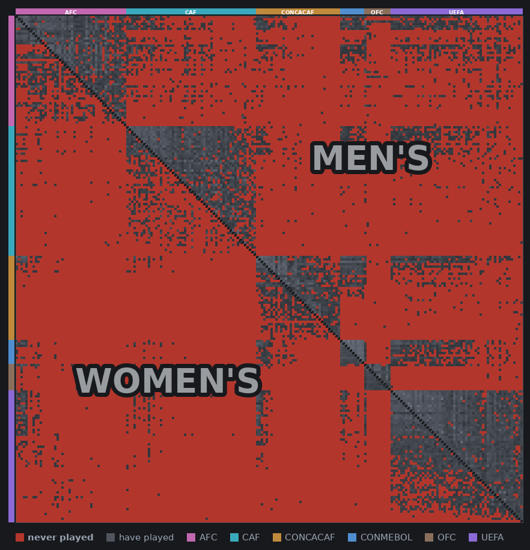

# National Team Matchup Grid

A Scorigami-inspired heatmap of international football. Every current FIFA member nation is a
row **and** a column of one massive grid; each cell is coloured by how many times those two
national teams have ever played each other. The point of the picture is the **negative space** —
the matchups that have *never* happened.

**▶ Live demo: https://dgoodenough.github.io/national-team-grid/**



Only **29% of all possible men's matchups** have ever been played — and only **13% of the women's**.
The rest of the grid is empty: pairs of countries that, in 150+ years of international football,
have simply never met.

## How to read it

- **Rows and columns** are national teams, **grouped by confederation** (AFC, CAF, CONCACAF,
  CONMEBOL, OFC, UEFA) and then ordered by FIFA ranking within each confederation. Teams in the
  same confederation play each other far more often, so the grid lights up in dense blocks down
  the diagonal, with sparse cross-confederation regions between them.
- **Cell colour** = number of times the pair has met (log-scaled, cool → hot). The most-played
  men's fixture is **Argentina–Uruguay (183 meetings since 1902)**.
- **Empty (near-black) cells** = the two teams have *never* played. Flip on **Highlight
  never-played** to invert the emphasis and make those cells glow.
- The **diagonal** is greyed out (a team can't play itself).

## Views

The grid answers "have these two ever played?". Four list views answer the questions it can
only hint at — each is a tab above the grid, and each is linkable.

All five obey the same controls: the confederation filter, the ticked teams, the dataset
toggle and the timeline scrubber narrow every view, not just the grid. Filter to CONMEBOL and
scrub to 1950 and *One-offs* answers "which South American pairs had met exactly once by 1950".
Each view names the archive and filter behind the number it is printing.

| View | What it shows |
| --- | --- |
| **Grid** | The 211×211 matrix itself. |
| **Fixtures** | Every pairing that has **never met** and has a date on the calendar, with a countdown. The default view on phones. Unfiltered, it is the same list the [RSS/JSON feed](#syndication) carries; it covers both games at once, so the dataset toggle is disabled here rather than sitting there doing nothing. |
| **One-offs** | The ~1,500 men's pairings that have played **exactly once**, oldest first — the top of that list is the longest-standing unrepeated fixture in international football. |
| **Near misses** | Pairs that have never met, ranked by how many opponents they *already* have in common. Nothing here is scheduled: it is the list of fixtures that keep not happening. Russia–Bosnia share 73 opponents and have never played; so do Canada–Sweden, Japan–Morocco, South Korea–Estonia. |
| **Connect** | Degrees of separation. The shortest chain of matches actually played between any two teams — Tonga reaches Brazil in two hops. |

## Features

- **Zoom & pan** the full 211×211 grid (mouse wheel or the on-grid −/Fit/+ controls; drag to pan).
- **Works on a phone.** The label gutter shrinks with the cells, so *Fit* fits; a tap zooms to
  a legible cell and shows a preview card with the pairing named before you commit to opening
  it (a 2px cell is not a tap target), and long-press previews without zooming.
- **Men's ↔ Women's ↔ Both** toggle — two completely separate match archives, each with its own
  current FIFA ranking. **Both** overlays them into a four-colour view: pairings that have met in
  *both* games (green), the *men's only* (blue), the *women's only* (orange), and *neither* — so
  you can see where one game has explored a matchup the other hasn't (≈4,000 men's-only vs a few
  hundred women's-only today, and the gap closes as you scrub forward through time).
- **Sort** four ways: *Confederation, then FIFA rank* (default — confederations form blocks);
  *FIFA rank, global* (straight down the line, confederations interleave into a colour stripe);
  *Total matches played*; or *Alphabetical*.
- **Filter by confederation** — show one, several, or all.
- **Click any cell** — see every meeting between those two teams (year, score, tournament) plus
  the head-to-head W–D–L record. The per-match detail is loaded on demand on the first click, so it
  doesn't slow the initial grid.
- **Hover** any cell for a quick tooltip (meetings + first/last year).
- **Manual team checklist** — tick **one** team to see all of its matchups ranked from
  most- to least-played (with a *never-met* tally; in **Both** mode, opponents are grouped by
  which game(s) they've met in); tick **two or more** to build a custom sub-grid using the
  chosen sort.
- **Highlight never-played** mode for the full Scorigami effect.
- **Upcoming FIFAGami** — highlight in yellow the pairs that have *never* met but have a
  scheduled fixture, plus a scrollable list of them (soonest first; click one for the
  head-to-head). Fixtures come from martj42's advance listings merged with ESPN's public
  scoreboard across ~30 senior international competitions (both genders), looking up to two
  years out. The browser's current date decides what's still "upcoming" vs already played,
  so it stays accurate between data refreshes.
- **Timeline scrubber** — drag through the years and watch the grid fill in; empty cells are
  matchups that hadn't happened *yet*. Press **▶** and it plays 1872 → today on its own.
  Scrubbing is driven by the first-meeting year already in the matrix, so the grid moves
  instantly and never blocks on a download.
- **Include defunct teams** (advanced) — adds historical sides with no single modern successor
  (Yugoslavia, Czechoslovakia, East Germany / German DR, the Saar, South Vietnam, South Yemen…).
- A live headline counts how many of the possible matchups in the current view have **never**
  happened.
- **Three kinds of empty, told apart.** A blank cell used to mean "never met", "hadn't happened
  yet" and "this team has never played anyone" all at once. Scrub back before a team's debut and
  its row greys out; the handful of members with *no* internationals at all in an archive
  (Brunei, Montserrat, Oman, San Marino, Somalia and Yemen have never played a women's
  international) get their own shade and their own line in the tooltip.
- **Everything is in the URL.** Dataset, sort, confederations, ticked teams, scrubbed year,
  highlight modes, the open view and even a specific head-to-head round-trip through the query
  string, so any view can be linked, bookmarked or captioned. **Copy link** puts the current one
  on the clipboard.
- **Light and dark.** Follows the OS preference, overridable, remembered. The canvas repaints
  in the newsprint palette too, not just the chrome.
- **Keyboard and screen-reader access to the grid.** Arrow keys walk the cells, Home/End jump
  along a row, `+`/`-` zoom, `f` fits, Enter opens the head-to-head, Escape closes it — and a
  live region reads out whatever the focus lands on. A canvas is invisible to assistive tech
  unless that navigation is built by hand.
- **Flags** next to team names throughout, and on the grid labels once the cells are large
  enough to have earned the space.
- **A share card.** `assets/og.png` is generated from the live data, so pasting the URL renders
  the current headline rather than a blank rectangle.

## Data

| Dataset | Source | Used for |
| --- | --- | --- |
| Men's internationals (1872–present, ~49k matches) | [martj42/international_results](https://github.com/martj42/international_results) | match counts, first/last meeting |
| Women's internationals (1969–present, ~12k matches) | [martj42/womens-international-results](https://github.com/martj42/womens-international-results) | match counts, first/last meeting |
| Historical team renames | `former_names.csv` (martj42) | folding old names into current teams |
| Current FIFA ranking, men's + women's | [FotMob](https://www.fotmob.com/fifaranking/men) (mirrors the official ranking) | rank ordering within / across confederations |
| Scheduled internationals (men's + women's) | ESPN public scoreboard API | upcoming first-ever meetings, up to ~2 years out |
| Confederation membership | [cnc8/fifa-world-ranking](https://github.com/cnc8/fifa-world-ranking) | which confederation each team belongs to |
| FIFA code → ISO 3166-1 | `data/iso2.csv` (in-repo) | flag emoji next to team names |

### Methodology notes

- **Current FIFA members only** (211 teams) in the default view. Confederation membership comes
  from the cnc8 snapshot, plus a tiny supplement (`data/members_extra.csv`) for any member missing
  from it (e.g. Cook Islands).
- **Name reconciliation.** The three datasets spell some teams differently
  (`Côte d'Ivoire`↔`Ivory Coast`, `Korea Republic`↔`South Korea`, FotMob's `USA`/`Turkiye`/`Czechia`,
  …). `build.py` reconciles them all, and `former_names.csv` folds historical names into their
  modern team (`Zaïre`→`DR Congo`, `Upper Volta`→`Burkina Faso`; USSR→Russia and
  Serbia & Montenegro→Serbia, per the source's lineage). Any team that resolves to neither a
  current member nor a curated defunct side (mostly non-FIFA territories like Martinique or Jersey)
  is excluded, and the build prints a full report of them.
- **Rankings are current and per-gender.** `build.py` pulls the latest men's and women's FIFA
  rankings from FotMob at build time (FIFA's own ranking API is gated; FotMob mirrors it). The
  exact publication date used is recorded in `members.json` and shown in the app footer. cnc8's
  2020 men's rank is kept only as an offline fallback. ~14 FIFA members have never been given a
  women's ranking; they sort last within their confederation.

## Build it yourself

`build.py` uses only the Python standard library (no dependencies).

```bash
python build.py            # download sources, reconcile, aggregate, write docs/data/*.json
python build.py --refresh  # force re-download of every source (latest matches + latest ranking)
python build.py --derive   # regenerate only the derived artifacts, no network, seconds not minutes
```

It downloads the sources into `data/raw/` (gitignored), then writes the artifacts the site loads:

- `docs/data/members.json` — ordered members with confederation + men's/women's rank + flag + data vintage
- `docs/data/matrix_men.json`, `matrix_women.json` — sparse `[i, j, meetings, firstYear, lastYear]`
- `docs/data/matches_men.json`, `matches_women.json` — per-pair meeting detail (year, score,
  tournament), lazy-loaded by the site only when a cell is clicked
- `docs/data/years_men.json`, `years_women.json` — just the meeting *years* per pair,
  delta-encoded. The scrubber needs "how many by year Y" and nothing else, so it reads this
  (188 KB) rather than the full match detail (705 KB)
- `docs/data/defunct.json` — the advanced defunct-teams layer
- `docs/data/upcoming.json` — scheduled first-ever meetings (upcoming FIFAGami)
- `docs/feed.json`, `docs/feed.xml` — the same upcoming meetings as a subscribable feed

`--derive` rebuilds the last three groups (years, feeds, flags) from what is already in
`docs/data`, which is what you want when iterating on the frontend rather than the sources.

Raster images (README hero, share card, touch icon) come from `python render_hero.py`, which
reads the confederation palette and the meetings ramp straight out of `docs/style.css` so the
pictures cannot drift from the site. The share card quotes a live figure, so the daily refresh
regenerates and commits it alongside the data — otherwise a pasted link would keep advertising
a never-played count from whenever the images were last built by hand.

Then serve the static site from `docs/`:

```bash
python -m http.server -d docs 8000   # open http://localhost:8000
```

## Tests

```bash
python -m unittest discover -s tests -v
```

The site is a static build committed straight to the repo by a daily GitHub Action, so the
artifacts in `docs/data` *are* the product and nobody reads that commit's diff. The suite runs
in CI on every push and again inside the refresh workflow **before** it is allowed to commit:
`build.py` raises on a structurally broken artifact (a pair referencing an unknown team, a
years file disagreeing with the matrix, a "first meeting" between two teams who have already
played), and the tests catch the subtler drift — a confederation losing members, the
most-played fixture changing identity, the feeds falling out of sync with the data.

## Syndication

Upcoming first-ever meetings are published as [RSS](https://dgoodenough.github.io/national-team-grid/feed.xml)
and [JSON Feed](https://dgoodenough.github.io/national-team-grid/feed.json). Item ids are stable
per pair and date, so a reader shows an entry once — when a fixture between two nations that
have never met first appears on the calendar, which is the thing actually worth being told
about. Every item links back to that pairing in the app.

## Data vintage & updating

The match archives are the live edge of the project — martj42 updates them within a day or two of
most internationals. **The current cut-off date for each archive is recorded in `members.json`
(`data_through`) and shown in the app footer.** Everything is easy to refresh or extend:

- **More recent matches** — just re-run `python build.py --refresh`. It re-pulls the latest martj42
  results and the latest FotMob ranking, so the grid moves forward with no code changes.
- **Override a ranking** — drop a `data/ranking_men.csv` or `data/ranking_women.csv`
  (`name,rank` header, names matching the canonical member names) and the build uses it instead of
  FotMob. Handy for pinning a specific publication or hand-correcting.
- **Add a missing member** — append to `data/members_extra.csv` (`name,code,confed`).
- **Append your own matches** — the aggregation reads plain CSVs with martj42's columns
  (`date,home_team,away_team,home_score,away_score,tournament,city,country,neutral`); extra rows in
  `data/raw/results_*.csv` flow straight through.

## Roadmap / ideas

- **Cluster analysis.** The grid already hints at tight clusters — the British Isles
  (England / Scotland / Wales / Northern Ireland / Ireland) light up as a dense little block. A
  proper community-detection pass over the "have-played" graph could surface these automatically.
- **The loneliest nodes.** *One-offs* and *Near misses* now cover the rarest fixtures and the
  pairs closest to meeting; the remaining half of that idea is ranking teams by how few distinct
  opponents they have ever faced (Tonga: ten, in its entire history).

## Tech

Pure static site — vanilla JavaScript + HTML5 Canvas, no build step and no runtime dependencies.
The ~44,000-cell grid is drawn directly to a canvas with view-culling for smooth zoom/pan. Pointer
Events drive one interaction path for both mouse (hover, drag, click, wheel) and touch (drag to pan,
pinch to zoom, tap to aim then confirm), and the layout reflows for phones — which lead with the
fixtures feed rather than a 211-column matrix. Hosted on GitHub Pages from `docs/`.

Two things the grid does to stay quick at 22,155 pairings: the headline's never-played count is a
prefix sum over each pair's first-meeting year, built once per view change and read in O(1) per
frame of a timeline drag (it used to walk every pair on every frame); and the played graph is held
as bitsets, so common-opponent counts for all 15,635 never-played pairs — the *Near misses* view —
come out in a few milliseconds.

Styled with [Ledger](https://github.com/dgoodenough/style) (vendored `tokens.css`) — greyscale
carries structure, color carries meaning: the green ramp is "how often they've played", red is
"never", yellow is "upcoming".

## Credits

Match data © the [martj42](https://github.com/martj42) datasets; current FIFA rankings via
[FotMob](https://www.fotmob.com); upcoming fixtures via [ESPN](https://www.espn.com/soccer/)'s
public scoreboard API; confederation mapping from
[cnc8/fifa-world-ranking](https://github.com/cnc8/fifa-world-ranking). Concept inspired by
[Scorigami](https://nflscorigami.com) (Jon Bois). Code under the [MIT License](LICENSE).
